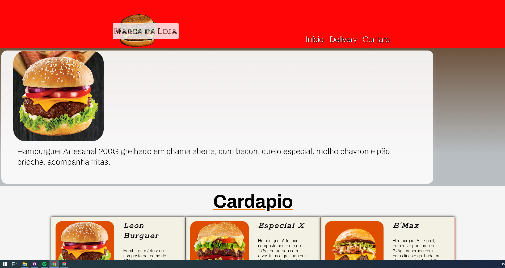
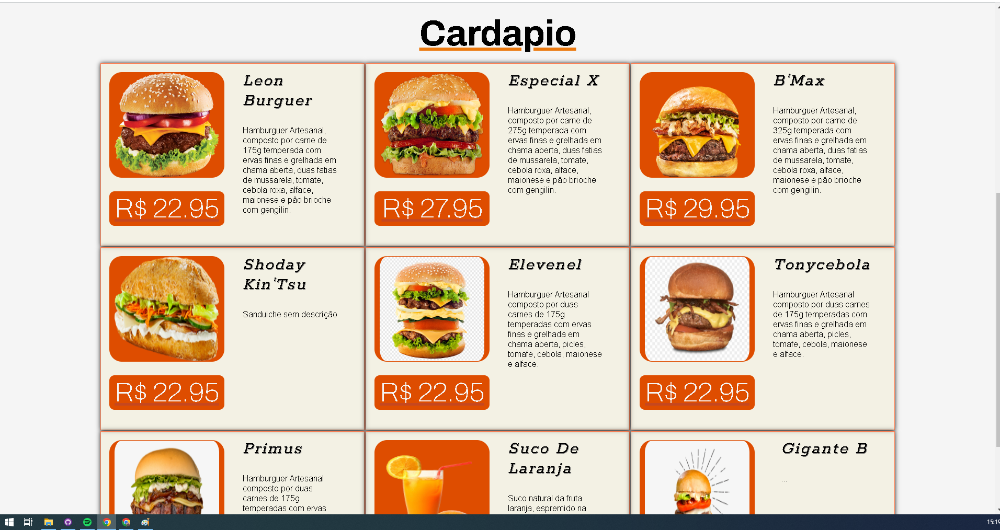
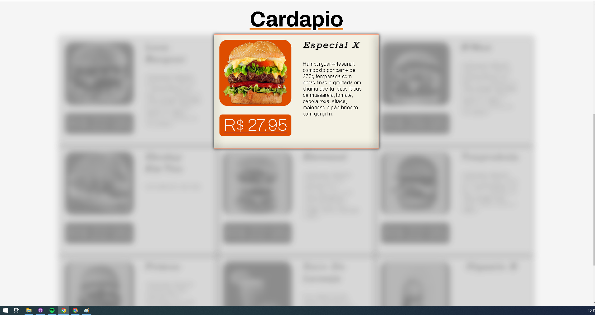
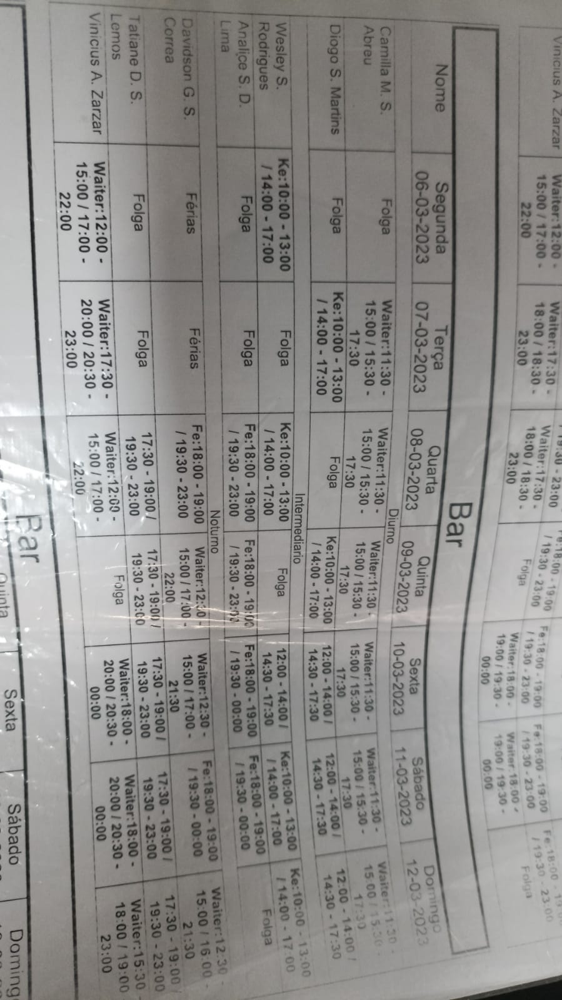
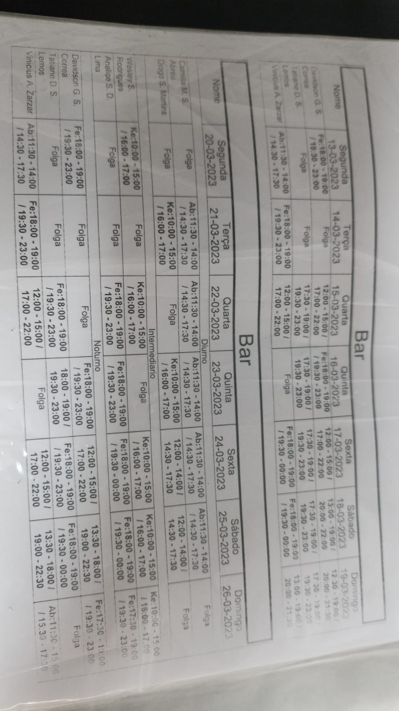
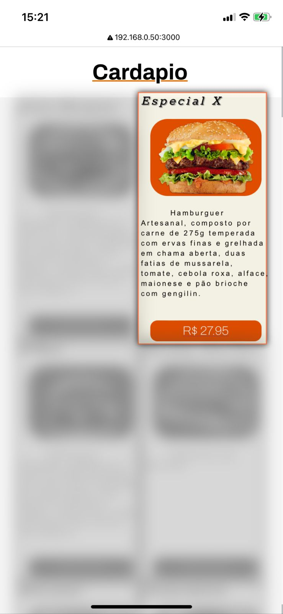

# Cardápio digital
VERSÂO 1.02.00

Este é um projeto de cardápio digital que usa React no front-end e Flask no back-end. Antes de tudo, mude o IP do projeto no arquivo 'configure.json'.
você pode encontralo em 'frontend/src/configure.json'. Lembrando que a API 
Flask ultiliza o ip deste arquivo json.

## Tecnologias usadas

- React
- Flask
- SQLite
- Python
## Screenshots
Desktop






Mobile







## Instalação

1. Clone o repositório
2. Instale as dependências do front-end:
    ```
    cd frontend
    npm install
    ```
3. Instale as dependências do back-end:
    ```
    cd ..
    cd ../api_flask
    pip install -r requirements.txt
    ```
4. Inicie o back-end:
    ```
    python app.py
    ```
5. Inicie o front-end:
    ```
    cd ../frontend
    npm start
    ```
6. Acesse o cardápio em http://seuip:3000
