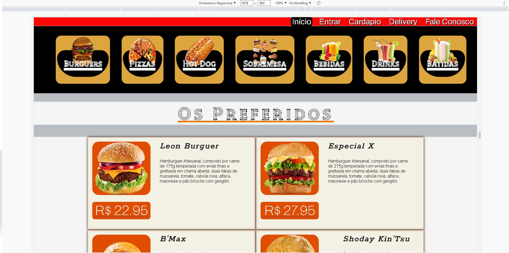
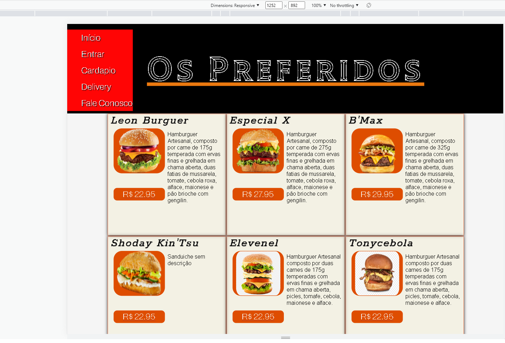
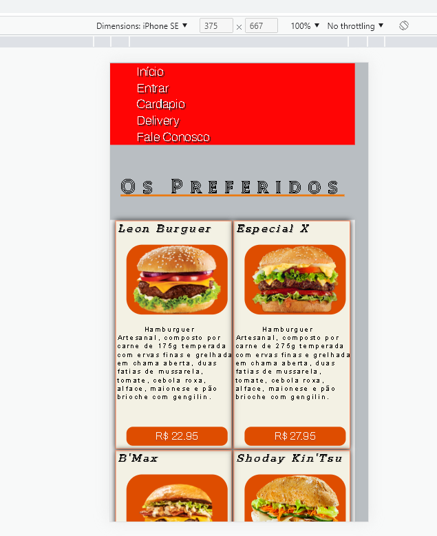

# Cardápio digital

Este é um projeto de cardápio digital que usa React no front-end e Flask no back-end.

## Tecnologias usadas

- React
- Flask
- SQLite
## Screenshots







## Instalação

1. Clone o repositório
2. Instale as dependências do front-end:
    ```
    cd frontend
    npm install
    ```
3. Instale as dependências do back-end:
    ```
    cd ..
    cd ../api_flask
    pip install -r requirements.txt
    ```
4. Inicie o back-end:
    ```
    python app.py
    ```
5. Inicie o front-end:
    ```
    cd ../frontend
    npm start
    ```
6. Acesse o cardápio em http://127.0.0.1:3000
